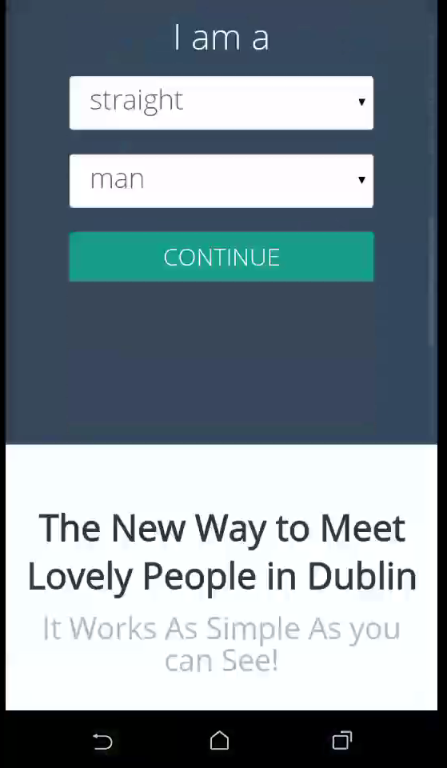

# WebView Android Dating App

### The Dating Android App for the [Local Irish Dating Site](http://dublin.meetlovelypeople.com), **Meet Lovely People**.
#### Meet Local Irish People in Dublin City!

## Overview

This app is used for [Meet Lovely People](http://meetlovelypeople.com) Local website for Dubliners. 

The design of MeetLovelyPeople is responsive that means we can easily create native apps without lot of code by only by using WebView.

## Want to do the Same?

You can also create a dating business for free with for example this **[Free Responsive Dating App Builder](http://ph7cms.com)**. 

You will be able then when your site is live to edit this app and change only `public final static String DOMAIN_SITE = "dublin.meetlovelypeople.com";` by the domain of your site like `public final static String DOMAIN_SITE = "my-ph7cms-dating-app.com";`

Finally, for changing the name of your app, just edit `/app/src/main/res/values/strings.xml` and change the second line like the following: `<string name="app_name">My Awesome Social Dating App</string>`

Then don't forget to compile the project and build the APK file.

## Author

Pierre-Henry Soria

## Contact

contact {AT} hizup {D0T} net

## Need a Professional Dating Site/App...?

Feel free to Say Hello here in the UK and asking a free quote to our **[Web Agency](http://hizup.uk)**.

## License

This App and Code is under [Apache License, Version 2.0](http://www.apache.org/licenses/LICENSE-2.0.txt) or later; Check the LICENSE.txt file for more details.